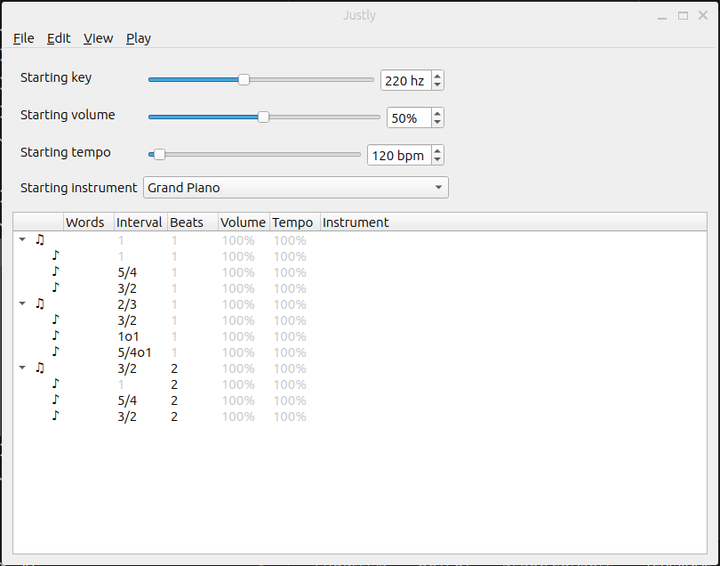
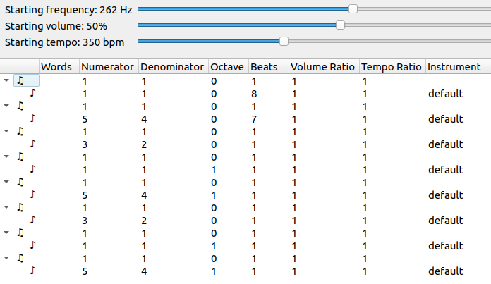
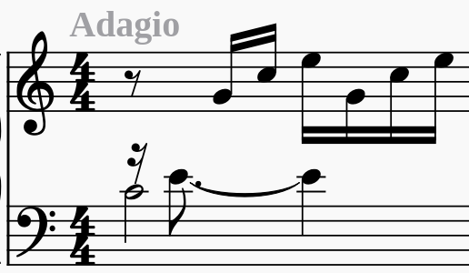

# Justly

> [!IMPORTANT]  
> Requires dependencies on Linux. To install, run `sudo apt install fluidsynth qt6-base-dev qt6-gtk-platformtheme qt6-wayland`.

> [!IMPORTANT]  
> Requires dependencies on MacOS. To install, run `brew install fluid-synth qt`.

## Installation

You can download binaries for Justly [here](https://github.com/bramtayl/Justly/releases/latest).
The Justly executable is in the "bin" subfolder.

## Motivation

You can use Justly to both compose and play music using any pitches you want.
Using staff notation, you can only write the notes of the 12-tone scale.
Some intervals in any 12-tone scale are close to harmonic, but other intervals are not.
Johnston [expanded staff notation](http://marsbat.space/pdfs/EJItext.pdf), but relying on staff notation limited him.

## Notation

### Ratios

In Justly, you write ratios as a a rational fraction (integer / integer).
The numerator will be omitted if it is one. Therefore:

- "" represents the ratio 1
- "/2" represents the ratio $\frac{1}{2}$

### Intervals

In Justly, you write intervals as a rational fraction (integer / integer) times a power of 2.
An "o" suffix is a short hand for "\*2^", similar to how the "e" suffix is shorthand for "*10^".

The numerator will be omitted if it is one. Therefore:

- "" represents the interval 1
- "/3" represents the interval $\frac{1}{3}$
- "o1" represents the interval $2^1$
- "/3o1" represents the interval $\frac{1}{3}*2^1$

You will likely only need to know 4 "prime" intervals.

- Octave: 2
- Perfect fifth: $\frac{3}{2}$
- Major third: $\frac{5}{4}$
- Harmonic seventh: $\frac{7}{4}$

Note that the numerators of these fractions are the first 4 prime numbers.

To go up by an interval, multiply by the interval.
So to go up by a fifth, multiply by $\frac{3}{2}$.
To go down instead of up, divide by the interval.
So to go down by a fifth, divide by $\frac{3}{2}$ = multiply by $\frac{2}{3}$.

You can write the same ratio in multiple ways.
For example, you can write a fifth as $\frac{3}{2}$, or "3o-1" = $\frac{1}{3}*2^{-1}$.

You can create new intervals by multiplying and dividing intervals.
For example, a minor third is up a perfect fifth and down a major third: $\frac{3}{2} \div \frac{5}{4} = \frac{6}{5}$.

Here are some useful composite intervals:

- Major second: $\frac{9}{8}$
- Minor third: $\frac{6}{5}$
- Perfect fourth: $\frac{4}{3}$
- Minor sixth: $\frac{8}{5}$
- Major sixth: $\frac{5}{3}$
- Minor seventh: $\frac{9}{5}$
- Major seventh: $\frac{15}{8}$

## Starting values

- "Starting instrument" is the starting instrument.
- "Starting key" is the starting key, in Hz. For reference, see the [piano key frequencies on Wikipedia](https://en.wikipedia.org/wiki/Piano_key_frequencies).
- "Starting volume percent" is the starting volume percent, between 0 and 100%.
- "Starting tempo" is the starting tempo, in beats per minute (bpm).

## Instruments

You can use any of the instruments included with [MuseScore soundfont](https://ftp.osuosl.org/pub/musescore/soundfont/MuseScore_General/).

## Chords and Notes

In Justly, there are "chords" and "notes".
A chord is a set of notes that begin playing simulataneously.

Chords and notes have the following fields, each corresponding to a column:

- "Type": whether the row is a chord or a note row
- "Instrument": the instrument
- "Interval": the pitch interval
- "Beats": the number of beats
- "Volume ratio": the volume ratio
- "Tempo ratio": the tempo ratio
- "Words": text associated with the chord or note

I discuss each in more detail below.

### Type

"♫" signals a chord row and "♪" signals a note row.

### Instrument

If you specify the instrument of a note, you will change the instrument of that note only.
If you do not specify the instrument of a note, you will use the current default instrument.

If you specify the instrument of a chord, you will change the default instrument for future chords (until you specify another default instrument).

### Interval

The interval of a note is its interval relative to the current key.
Changing the interval of a note does not change the current key.

The interval of a chord is the modulation of the current key.
Changing the key of a chord changes the key of all future chords.

### Beats

The beats of a chord is the number of beats until the next chord starts.

Once the chord starts, each note in the chord will play for its number of beats.

### Volume ratio

The volume ratio of a note is its volume ratio relative to the current volume.
Changing the volume ratio of a note does not change the current volume.

The volume ratio of a chord is the modulation of the current volume.
Changing the volume ratio of a chord changes the volume of all future chords.

### Tempo ratio

The tempo ratio of a note is its tempo ratio relative to the current tempo.
Thus, notes with higher tempo ratios will sound more stacatto.
Changing the volume ratio of a note does not change the current tempo.

### Words

You can annotate chords or notes with arbitrary text.

## Interface

### Controls

You can edit the starting instrument, starting key, starting volume percent, and starting tempo using the controls on the right.

You can also edit the playback volume with the playback volume slider.

### Chords editor

Double click on a cell to edit it.
If you double click on an interval, you can edit the numerator, denominator, or octave of that interval.
If you double click on beats, a tempo ratio, or a volume ratio, you can edit the numerator or denominator of that ratio.

You can select a single cell by clicking on it.
You can select a whole row by clicking the symbol on the far left of the row.
You can select a contiguous group of chord rows, or a contiguous group of note rows, but not a combination of chords and note rows.

What you have selected affects which actions you can do.
For example, you can only insert a note into a chord if you have selected exactly one chord row.

### File Menu

Using the file menu, you can choose among the following:

- Choose "Open" to open a previously saved song.
- Choose "Save" to save a song in a previous location.
- Choose "Save As" to save the song in a new location.
- Choose "Export recording" to export a recording of the song as a wav file.

### Edit Menu

Using the edit menu, you can choose among following:

- Choose "Undo" to undo any action.
- Choose "Redo" to redo any action.
- Choose "Copy" to copy a selected cell, a selected group of notes rows, or a selected group of chords rows.
- Choose "Paste" to choose among the following:
  - Choose "Cell, after" to paste cell contents, or to paste chords/notes after the last selected chord/note respectively.
  - Choose "Into start" to paste notes/chords into an the start of a song/chord respectively.
- Choose "Insert" to choose among the following:
  - Choose "After" to insert a chord/note after the last selected row.
  - Choose "Into start" to insert a new chord/note into the start of a song/chord respectively.
- Choose "Delete" to delete cell contents, or remove a selected group of chords/notes.

### View Menu

You can choose whether or not to view the starting controls.

### Play Menu

Choose "Play selection" to play a selection of chords or notes.
If you play a selection of chords, you will skip the previous chords, and only play the selected chords.
If you play a selection of notes within a chord, you will skip all previous chords, and only play the selected notes within the chord.

Choose "Stop Playing" to stop playing a previous request.

## Examples

### Example 1: Harmony

Here is screenshot of the song [examples/simple.json](examples/simple.json) in the examples folder.

This song starts with a key of frequency 220Hz, that is, A3.
The key does not change in the first chord.
The three voices in the first chord play the tonic (≈A3), third (≈C#4), and fifth (≈E4).
All three voices play for "1" beat.

After 1 beat, the key changes: you divide the key by $\frac{3}{2}$, so the key goes down by a fifth.
Now the key is close to D4.
The three voices play the fifth (≈A3), up one octave (≈D4), and up one octave and a third (≈F#4). 

After 1 more beat, you multiply the key by $\frac{3}{2}$, so the key goes up by a fifth. The voices repeat the items in the first chord, but play for "2" beats.

### Example 2: Melody

Here is screenshot of the song [examples/well_tempered_clavier.json](examples/well_tempered_clavier.json) in the examples folder.

This is the start of Bach's Well-Tempered Clavier (BMV 846).
Ironically, Bach used this work to evangelize equal temperament (the arch-enemy of Justly).
Here is the sheet music for reference:

The whole figure is in the key of 262 Hz (≈ middle C). 

All of the "chords" have a ratio of $\frac{1}{4}$ because each new notes play every sixteenth note.

Each note starts at a different time.
Because a chord represents a set of notes that begin playing simultaneously, in this song, each note has its own "chord". 

Each "chord" lasts for $\frac{1}{4}$ of a beat.
The first note, however, plays for 2 beats.
$\frac{1}{4}$ of a  beat into the first note, the second note starts, and plays for $\frac{7}{4}$ beats.
The rest of the notes play for $\frac{1}{4}$ of a beat.
At the end of all 8 "chords", the first two notes stop playing.
