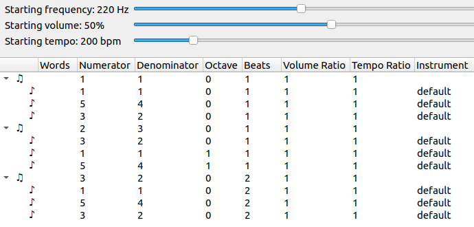

# Justly

[](https://codecov.io/gh/bramtayl/Justly)

## Motivation

You can use Justly to both compose and play music using any pitches you want.
Using staff notation, you can only write the items of the 12-tone scale.
Some intervals in any 12-tone scale are close to harmonic, but other intervals are not.
Johnston [expanded staff notation](http://marsbat.space/pdfs/EJItext.pdf), but relying on staff notation limited him.

##  Downloading

You can download binaries of the [latest release](https://github.com/bramtayl/Justly/releases/latest).

## Song files

You can pass 1 command line argument to Justly: a song file to open.
If you don't pass any arguments, Justly will prompt you to open or create a song file.
Justly will save your song when you close the editor.

## Intervals

In Justly, you write intervals as a rational fraction (integer / integer) times a power of 2.
You can write the same ratio in multiple ways.
For example, you can write a fifth as `3/2`, or `3o-1`, where `o-1` means `*2^-1`.

You will likely only need to know 4 "prime" intervals.

- Octave: `2`
- Perfect fifth: `3/2`
- Major third: `5/4`
- Harmonic seventh: `7/4`

Note that the numerators of these fractions are the first 4 prime numbers.

To go down instead of up, flip the fraction.
So to go down by a fifth, multiply by `2/3`.

You can create other intervals by multiplying and dividing these intervals.
For example, a minor third is up a perfect fifth and down a major third: `(3/2) / (5/4)` = `6/5`.

Useful composite intervals:

- Major second: `9/8`
- Minor third: `6/5`
- Perfect fourth: `2/3o1`
- Minor sixth: `4/5o1`
- Major sixth: `5/6o1`
- Minor seventh: `9/5`
- Major seventh: `15/8`

## Top sliders

You can edit the starting frequency, starting volume, and starting tempo using the sliders on the top.

- `Starting frequency` is the starting frequency, in Hz.
- `Starting volume` is the starting volume, between 0 and 100%. To avoid peaking, lower the volume for songs with many voices.
- `Starting tempo` is the starting tempo, in beats per minute. These beats are indivisible, so for songs which subdivide beats, you will need to multiply the tempo accordingly.

# Chords vs. Notes

In Justly, there are "chords" and "notes".
A chord is a set of "notes" that will begin playing simulataneously.
A chord modulates the song, while a note does not, in the following sense.
The interval, volume ratio, and tempo ratio changes in chords are cumulative, and will affect all future chords.
So for example, if you set the tempo ratio for a chord to `2.0`, you will double the tempo of that chord and all future chords.
The interval, volume ratio, and tempo ratio in a note are in reference to the chord, but only affect the note itself.
So for example, if you set the tempo ratio for a chord to `2.0`, you will double the tempo of that note only (that is, you will make the note stacatto).
You can change the instrument of notes, but not chords.
Currently, Justly can only play one instrument: "default".
Contributions of new instruments are welcome.

## Example

Here is screenshot of the song [simple.json](examples/simple.json) in the examples folder.



This song starts with a key of frequency 220Hz, that is, A3.
The key does not change in the first chord.
The three voices in the first chord play the tonic (≈A3), third (≈C#4), and fifth (≈E4).
All three voices play for `1` beat.

After 1 beat, the key changes: you divide the key by `3/2`, so the key goes down by a fifth.
Now the key is close to D4.
The three voices play the fifth (≈A3), up one octave (≈D4), and up one octave and a third (≈F#4). 

After 1 more beat, you multiply the key by `3/2`, so the key goes up by a fifth. The voices repeat the items in the first chord, but play for `2` beats.

## Build instructions

### Depdendencies

- A C and C++ compiler
- [cmake](https://cmake.org/)
- [git](https://git-scm.com/)
- The [gamma](https://w2.mat.ucsb.edu/gamma/) package from [vcpkg](https://vcpkg.io/en/index.html):
    - `git clone https://github.com/Microsoft/vcpkg.git`
    - `cd vcpkg`
    - Windows:
        - `./bootstrap-vcpkg.bat`
        - `./vcpkg install gamma:x64-windows`
    - Other:
        - `./bootstrap-vcpkg.sh`
        - `./vcpkg install gamma`
- Qt6
    - macOS: `brew install qt`
    - Ubuntu: `sudo apt install qt6-base-dev`
    - Windows: 
        - Download Qt, perhaps using [aqtinstall](https://github.com/miurahr/aqtinstall).
        - Set `Qt6_ROOT` as an environmental variable pointing to Qt, for example, `$env:Qt6_ROOT="C:/Users/brand/qt/6.4.1/msvc2019_64"`, where you replace
            - `C:/Users/brand/qt` with the path to Qt
            - `6.4.1` with the Qt version.
            - `msvc2019_64` with your compiler info.

### Download and configure

```
git clone https://github.com/bramtayl/Justly.jl.git
cmake -B "build" -D "CMAKE_TOOLCHAIN_FILE=C:/vcpkg/scripts/buildsystems/vcpkg.cmake"
```

where you replace `C:/vcpkg` with the path to where you installed vcpkg.

### Build

- On Windows, open Powershell with admin access, and then: `cmake --build "build" --config "Release" --target install`
- Non-Windows: `sudo cmake --build "build" --config "Release" --target install`


