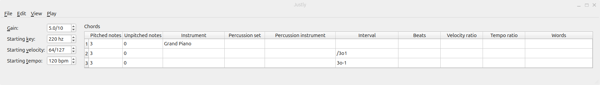
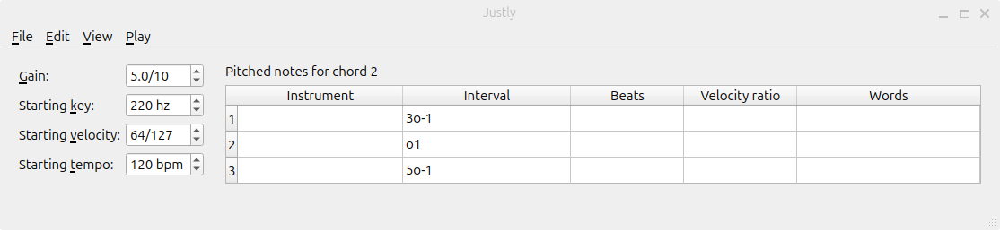
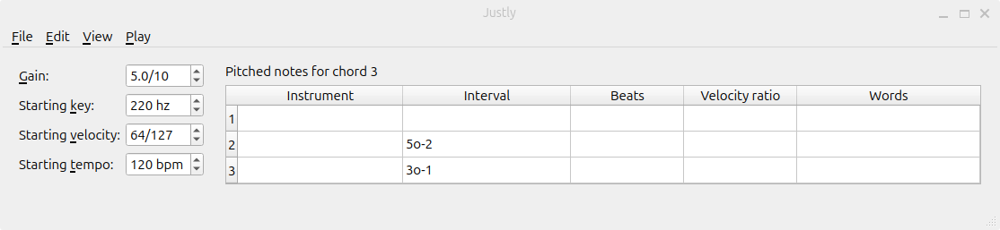

# Justly

> [!IMPORTANT]
> Requires dependencies on Linux. To install, run `sudo apt install fluidsynth qt6-base-dev qt6-gtk-platformtheme qt6-wayland`.

> [!IMPORTANT]
> Requires dependencies on MacOS. To install, run `brew install fluid-synth qt`.

## Installation

You can download binaries for Justly [here](https://github.com/bramtayl/Justly/releases/latest).
The Justly executable is in the "bin" subfolder.

## Motivation

You can use Justly to both compose and play music using any pitches you want.
Using staff notation, you can only write the pitched notes of the 12-tone scale.
Some intervals in any 12-tone scale are close to harmonic, but other intervals are not.
Johnston [expanded staff notation](http://marsbat.space/pdfs/EJItext.pdf), but relying on staff notation limited him.

## Notation

### Ratios

In Justly, you write ratios as a a rational fraction (integer / integer).
Justly will omit the numerator if it is 1, and omit the denominator if it is 1.
Therefore:

- "" represents the ratio 1
- "/2" represents the ratio $\frac{1}{2}$

### Intervals

In Justly, you write intervals as a rational fraction (integer / integer) times a power of 2.
An "o" suffix is a short hand for "\*2^", similar to how the "e" suffix is shorthand for "*10^".

Justly will omit the numerator if it is 1, the denominator if it is 1, and the octave if it is 0.
Therefore:

- "" represents the interval 1
- "/3" represents the interval $\frac{1}{3}$
- "o1" represents the interval $2^1$
- "/3o1" represents the interval $\frac{1}{3}*2^1$

You will likely only need to know 4 "prime" intervals.

- Octave: 2
- Perfect fifth: $\frac{3}{2}$
- Major third: $\frac{5}{4}$
- Harmonic seventh: $\frac{7}{4}$

Note that the numerators of these fractions are the first 4 prime numbers.

To go up by an interval, multiply by the interval.
So to go up by a fifth, multiply by $\frac{3}{2}$.

To go down instead of up, divide by the interval.
So to go down by a fifth, divide by $\frac{3}{2}$ = multiply by $\frac{2}{3}$.

You can write the same interval in multiple ways.
For example, you can write a fifth as $\frac{3}{2}$, or "3o-1" = $\frac{3}{1}*2^{-1}$.

You can create new intervals by multiplying and dividing intervals.
For example, a minor third is up a perfect fifth and down a major third: $\frac{3}{2} \div \frac{5}{4} = \frac{6}{5}$.

Here are some useful composite intervals:

- Major second: $\frac{9}{8}$ = perfect fifth * perfect fifth / octave
- Minor third: $\frac{6}{5}$ = perfect fifth / major third
- Perfect fourth: $\frac{4}{3}$ = octave / perfect fifth
- Minor sixth: $\frac{8}{5}$ = octave / major third
- Major sixth: $\frac{5}{3}$ = octave / perfect fifth * major third
- Minor seventh: $\frac{9}{5}$ = perfect fifth * perfect fifth / major third
- Major seventh: $\frac{15}{8}$ = perfect fifth * major third

I suggest using a [rational calculator](https://www.symbolab.com/solver/rational-expression-calculator) to multiply and divide intervals.

### Gain vs. velocity

In Justly, there are two kinds of volume: "gain", which is the speaker volume, and "velocity", the force with which Justly plays a note. You can adjust the gain of the whole song, or the velocity of different notes.

### Starting values

- "Gain" is the gain, between 0 and 10.
- "Starting key" is the starting key, in Hz. For reference, see the [piano key frequencies on Wikipedia](https://en.wikipedia.org/wiki/Piano_key_frequencies).
- "Starting velocity" is the starting velocity, between 0 and 127.
- "Starting tempo" is the starting tempo, in beats per minute (bpm).

### Instruments

You can use any of the instruments included with [MuseScore soundfont](https://ftp.osuosl.org/pub/musescore/soundfont/MuseScore_General/).

### Chords, pitched notes, and unpitched notes

A chord is a set of pitched and unpitched notes that begin playing simulataneously.

Chords have the following fields, each corresponding to a column:

- "Instrument": If not empty, Justly changes the default instrument for pitched notes to this (see below).
- "Percussion set": If not empty, Justly changes the default percussion set for unpitched notes to this (see below).
- "Percussion instrument": If not empty, Justly changes the default percussion instrument for unpitched notes to this (see below).
- "Interval": Justly multiplies the current key by this ratio. Changing the interval of a chord changes the key of all future chords.
- "Beats": The number of beats until the next chord starts
- "Velocity ratio": Justly multiplies the current velocity by this ratio. Changing the velocity ratio of a chord changes the velocity of all future chords.
- "Tempo ratio": Justly multiplies the current tempo by this ratio. Changing the tempo ratio of a chord changes the tempo of all future chords.
- "Words": text associated with the chord
- "Pitched notes": the number of pitched notes in the chord
- "Unpitched notes": the number of unpitched notes in the chord

Both pitched and unpitched notes both have the following fields:

- "Beats": When Justly startings the chord, Justly will play the note ifor this this number of beats.
- "Velocity ratio": Justly sets the note velocity to the current velocity times this ratio. Changing the velocity ratio of a note does not change the current velocity.
- "Words": text associated with the note.

Pitched notes have the following additional fields.

- "Instrument": The instrument of the pitched note. If empty, Justly will use the default instrument for the chord (see above).
- "Interval": Justly sets the note's pitch to this interval times the current key. Changing the interval of a pitched note does not change the current velocity.

On the other hand, unpitched notes have the following additional fields.

- "Percussion set": The percussion set of the unpitched note. If empty, Justly will use the default percussion set for the chord (see above).
- "Percussion instrument": The percussion instrument of the unpitched note. If empty, Justly will use the default percussion instrument for the chord (see above).

## Interface

### Controls

You can edit the gain, starting key, starting velocity, and starting tempo using the controls on the left.

### Table editor

Each row of the table represents a unit: a chord, pitched note, or unpitched note.

You can select a single cell by clicking on it.
Hold shift to select multiple cells.
When you select a chord or pitched note cell, Justly will show corresponding frequency and approximate piano key in the status bar at the bottom.

To edit the pitched notes of a chord, double click its "Pitched notes" cell. 
To edit the unpitched notes of a chord, double click its "Unpitched notes" cell.
To go back to the chords, select "Back to chords" from the "Edit" menu (see below).

### File Menu

In the "File" menu, you can choose among the following options:

- "Open" to open a previously saved song.
- "Save" to save the song in the previous location.
- "Save As" to save the song in a new location.
- "Export recording" to export a recording of the song as a wav file.

### Edit Menu

In the "Edit" menu, you can choose among the following options:

- "Undo" to undo any action.
- "Redo" to redo any action.
- "Cut" to cut a selected group of cells.
- "Copy" to copy a selected group of cells.
- "Paste" to choose among the following:
  - "Over" to paste over the selected cells.
  - "Into start" to paste rows into the start of the table.
  - "After" to paste rows after the selected cells.
- "Insert" to choose among the following:
  - "After" to insert a row after the selected cells.
  - "Into start" to insert a row into the start of the table.
- "Delete cells" to delete cell contents.
- "Remove rows" to remove selected rows.

### View Menu

In the "View" menu, you can choose among the following options:

- Check/uncheck "Controls" to view/hide the controls, respectively.

### Play Menu

In the play menu, you can choose among the following options:

- "Play selection" to play a selection of chords or notes. If you play a selection of chords, you will skip any previous chords, and only play the selected chords. If you play a selection of notes within a chord, you will skip any previous chords, and only play the selected notes within the current chord.
- "Stop Playing" to stop playing.

## Example

This example is the [simple.json](examples/simple.json) file in the examples folder.

Here is screenshot of the chords in the song:

The song starts with a key of frequency 220Hz, that is, A3.

In the first chord, Justly sets the default instrument to Grand Piano.
The key does not change in the first chord.

After 1 beat, the key changes: Justly divides the key by $\frac{3}{2}$, so the key goes down by a fifth. Now, the key is close to D4.

After 1 more beat, Justly multiplies the key by $\frac{3}{2}$, so the key goes up by a fifth. Now, the key is back to A3.

Here is a screenshot of the pitched notes in the first chord:

The pitched notes in the first chord are the tonic (≈A3), third (≈C#4), and fifth (≈E4).

Here is a screenshot of the pitched notes in the second chord:

The pitched notes in the second chord are the fifth (≈A3), up 1 octave (≈D4), and up 1 octave and a third (≈F#4). 

Here is a screenshot of the pitched notes in the third chord:

The pitched notes in the third chord are the tonic (≈A3), third (≈C#4), and fifth (≈E4).
